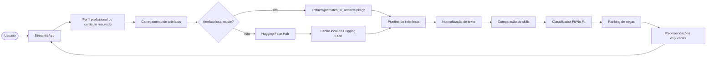

# JobMatch AI

> Aplicação end-to-end de Machine Learning para recomendar vagas compatíveis com um perfil profissional ou currículo resumido.

**Live demo:** [Acessar aplicação](https://jobmatch-fb.streamlit.app/)

## Problem statement

Profissionais que buscam vagas geralmente precisam analisar manualmente muitas descrições de emprego para entender quais oportunidades combinam melhor com seu perfil, suas habilidades e sua expectativa de salário.

Esse processo é repetitivo, subjetivo e pouco escalável, principalmente quando o volume de vagas é grande.

O **JobMatch AI** resolve esse problema com uma aplicação de Machine Learning que recebe um perfil profissional ou currículo resumido, compara esse texto com uma base de vagas e retorna recomendações ranqueadas por compatibilidade.

A aplicação mostra:

* vagas mais compatíveis
* Score Fit
* probabilidade estimada pelo modelo
* skills compatíveis
* skills faltantes
* salário estimado
* justificativa resumida da recomendação

## O que o projeto faz

O projeto implementa um fluxo end-to-end de Machine Learning com foco em recomendação de vagas.

O usuário informa um perfil profissional em linguagem natural, por exemplo:

```text
Sou desenvolvedor Python com experiência em APIs, SQL, Docker, análise de dados e cloud.
```

A aplicação processa esse texto, compara com as vagas disponíveis e retorna as melhores oportunidades com explicações úteis para tomada de decisão.

O sistema combina:

* similaridade textual entre perfil e vaga
* extração e comparação de skills
* classificador supervisionado Fit/No Fit
* ranqueamento final
* interface interativa em Streamlit
* artefato de modelo hospedado no Hugging Face
* versionamento de código no GitHub
* rastreabilidade e registro com MLflow/DagsHub

## Arquitetura



## Como funciona

O usuário acessa a interface em Streamlit e informa um perfil profissional ou currículo resumido.

O app carrega o artefato principal de Machine Learning. Em ambiente local, se o arquivo existir em `artifacts/jobmatch_ai_artifacts.pkl.gz`, ele é usado diretamente. Em ambiente de deploy, caso o arquivo não exista localmente, o sistema baixa automaticamente o artefato público hospedado no Hugging Face Hub.

Depois do carregamento, o pipeline de inferência processa o texto do usuário, calcula compatibilidade com as vagas disponíveis, compara skills, aplica o classificador Fit/No Fit e retorna uma lista ranqueada de recomendações.

A resposta final apresenta os principais sinais usados para a recomendação como score, probabilidade do modelo, skills em comum, skills faltantes e salário estimado.

## Componentes principais

| Componente                | Arquivo                                                 | Função                                          |
| ------------------------- | ------------------------------------------------------- | ----------------------------------------------- |
| Entrada da aplicação      | `app.py`                                                | Ponto de entrada usado pelo Streamlit Cloud     |
| Interface                 | `src/ui/streamlit_app.py`                               | Renderiza a tela, formulário e recomendações    |
| Carregamento de artefatos | `src/pipeline/inferencia/artefatos.py`                  | Carrega modelo local ou baixa do Hugging Face   |
| Recomendador              | `src/pipeline/inferencia/recomendador_modelo.py`        | Calcula ranking, scores, skills e recomendações |
| Validação de artefatos    | `src/pipeline/inferencia/validacao_artefatos.py`        | Verifica consistência dos artefatos do modelo   |
| Treinamento               | `src/pipeline/treinamento/treinar_classificador_fit.py` | Treina o classificador Fit/No Fit               |
| Features                  | `src/pipeline/treinamento/features_classificacao.py`    | Define extração de features textuais            |
| Observabilidade           | `src/observability/trace.py`                            | Logs e rastreamento de execução                 |
| MLflow/DagsHub            | `src/pipeline/registrar_modelo_mlflow.py`               | Registro do modelo e métricas                   |
| Testes                    | `tests/test_smoke.py`                                   | Testes mínimos de sanidade do projeto           |

## Artefato do modelo

O artefato principal é:

```text
jobmatch_ai_artifacts.pkl.gz
```

Ele contém os objetos necessários para a inferência, como dados processados, vetorizadores, classificador e estruturas auxiliares usadas pelo recomendador.

Por ser um arquivo grande, ele não é versionado diretamente no Git.

O artefato está hospedado no Hugging Face Hub:

```text
Fe62/jobmatch-ai-artifacts
```

Durante o deploy no Streamlit Cloud, o arquivo é baixado automaticamente usando `huggingface_hub`.

## Tech stack

* **Python**
* **Streamlit**
* **pandas**
* **NumPy**
* **SciPy**
* **scikit-learn**
* **TF-IDF**
* **Logistic Regression**
* **cloudpickle**
* **Hugging Face Hub**
* **MLflow**
* **DagsHub**
* **Pytest**
* **Ruff**
* **GitHub**
* **Streamlit Community Cloud**

## Estrutura do projeto

```text
jobmatch-ai/
├── src/
│   ├── __init__.py
│   ├── ui/
│   │   ├── __init__.py
│   │   └── streamlit_app.py
│   ├── pipeline/
│   │   ├── __init__.py
│   │   ├── demo/
│   │   │   ├── __init__.py
│   │   │   ├── demo.py
│   │   │   ├── data.py
│   │   │   └── recommender.py
│   │   ├── utils/
│   │   │   ├── __init__.py
│   │   │   └── text.py
│   │   ├── inferencia/
│   │   │   ├── __init__.py
│   │   │   ├── artefatos.py
│   │   │   ├── validacao_artefatos.py
│   │   │   └── recomendador_modelo.py
│   │   ├── treinamento/
│   │   │   ├── __init__.py
│   │   │   ├── features_classificacao.py
│   │   │   └── treinar_classificador_fit.py
│   │   └── registrar_modelo_mlflow.py
│   └── observability/
│       ├── __init__.py
│       ├── trace.py
│       └── mlflow_dagshub.py
├── tests/
│   ├── __init__.py
│   └── test_smoke.py
├── artifacts/
│   └── jobmatch_ai_artifacts.pkl.gz
├── data/
│   └── samples/
│       └── jobs_sample.csv
├── app.py
├── requirements.txt
├── pyproject.toml
├── .gitignore
├── .gitattributes
└── README.md
```

## Setup local

### 1. Clone o repositório

```bash
git clone https://github.com/fnd-lip/JobMatch.git
cd JobMatch
```

### 2. Crie e ative o ambiente virtual

No Windows PowerShell:

```powershell
python -m venv .venv
.\.venv\Scripts\Activate.ps1
```

Em Linux/macOS:

```bash
python -m venv .venv
source .venv/bin/activate
```

### 3. Instale as dependências

```bash
python -m pip install --upgrade pip
python -m pip install -r requirements.txt
```

### 4. Rode a aplicação localmente

```bash
streamlit run app.py
```

No Windows, caso o watcher do Streamlit cause lentidão ou erro com arquivos grandes, use:

```powershell
streamlit run app.py --server.fileWatcherType none
```

A aplicação abrirá em:

```text
http://localhost:8501
```

## Comandos úteis

### Rodar testes

```bash
python -m pytest
```

### Rodar testes com saída detalhada

```bash
python -m pytest -v
```

### Rodar lint com Ruff

```bash
python -m ruff check app.py src tests
```

### Corrigir automaticamente problemas simples de lint

```bash
python -m ruff check app.py src tests --fix
```

### Treinar novamente o classificador Fit/No Fit

```bash
python -m src.pipeline.treinamento.treinar_classificador_fit
```

### Validar artefatos

```bash
python -m src.pipeline.inferencia.validacao_artefatos
```

### Registrar modelo no MLflow/DagsHub

```bash
python -m src.pipeline.registrar_modelo_mlflow
```

## Deploy no Streamlit Cloud

A aplicação está publicada em:

```text
https://jobmatch-fb.streamlit.app/
```

Configuração usada no Streamlit Community Cloud:

| Campo          | Valor                                      |
| -------------- | ------------------------------------------ |
| Repository     | `fnd-lip/JobMatch`                         |
| Branch         | `main`                                     |
| Main file path | `app.py`                                   |
| Python         |  `3.13`                                    |

O deploy usa o GitHub como fonte do código e instala as dependências listadas em:

```text
requirements.txt
```

O modelo não é armazenado no repositório GitHub. Em produção, o app baixa o artefato automaticamente do Hugging Face Hub:

```text
Fe62/jobmatch-ai-artifacts
```

Como o repositório do modelo está público, não é necessário configurar `HF_TOKEN` nos secrets do Streamlit Cloud.

## Padrões e convenções da codebase

### Separação por responsabilidade

O projeto mantém a interface separada da lógica de Machine Learning.

A interface fica em:

```text
src/ui/
```

A lógica de inferência fica em:

```text
src/pipeline/inferencia/
```

A lógica de treinamento fica em:

```text
src/pipeline/treinamento/
```

A observabilidade fica em:

```text
src/observability/
```

Essa separação facilita manutenção, testes e evolução do projeto.

### `app.py` como ponto de entrada

O arquivo `app.py` é mantido como ponto de entrada simples para facilitar o deploy no Streamlit Cloud.

Ele deve apenas importar e executar a aplicação principal da interface.

### Artefatos grandes fora do Git

Arquivos grandes de modelo não devem ser commitados no Git.

O `.gitignore` mantém ignorados arquivos como:

```text
artifacts/*.pkl
artifacts/*.pkl.gz
artifacts/*.joblib
```

O artefato principal é armazenado no Hugging Face Hub e baixado sob demanda.

### Inferência independente da interface

Os módulos em `src/pipeline/inferencia/` não devem depender diretamente do Streamlit.

Isso permite testar a inferência via terminal, notebooks, scripts ou futuras APIs sem acoplar o código a UI.

### Treinamento separado da inferência

O treinamento do classificador fica em `src/pipeline/treinamento/`, separado do código usado em produção.

Essa organização permite retreinar, validar e registrar o modelo sem alterar a interface.

### Testes mínimos de sanidade

O projeto inclui testes de smoke para garantir que os principais módulos importam corretamente e que a estrutura básica da aplicação continua funcionando.

Para validar antes de um commit:

```bash
python -m ruff check app.py src tests
python -m pytest
```

## Design decisions

* **Streamlit:** escolhido pela simplicidade para publicar uma interface interativa de Machine Learning.
* **TF-IDF:** abordagem leve, interpretável e suficiente para comparar textos de perfis e vagas.
* **Logistic Regression:** classificador simples, rápido e adequado como baseline supervisionado.
* **Hugging Face Hub:** usado para hospedar o artefato grande fora do Git.
* **MLflow/DagsHub:** usado para rastreabilidade de experimentos, métricas e registro do modelo.
* **Separação entre UI, inferência e treinamento:** reduz acoplamento e melhora manutenção.
* **`requirements.txt` enxuto:** facilita o deploy no Streamlit Cloud e reduz chance de conflitos.
* **Smoke tests:** garantem validação rápida antes de commit e deploy.

## Limitações

* O ranking depende da qualidade dos dados de vagas disponíveis no artefato.
* O modelo atual é um baseline clássico com TF-IDF e regressão logística.
* O sistema ainda não faz atualização automática contínua da base de vagas.
* O app não executa treinamento em produção.
* A explicação das recomendações é baseada nos sinais disponíveis, como score, probabilidade e skills comparadas.
* O artefato de modelo é baixado no primeiro carregamento do app, o que pode aumentar o tempo inicial de abertura.

## Links do projeto

| Recurso          | Link                                                |
| ---------------- | --------------------------------------------------- |
| App publicado    | `https://jobmatch-fb.streamlit.app/`                |
| GitHub           | `https://github.com/fnd-lip/JobMatch`               |
| DagsHub          | `https://dagshub.com/felipefebl/JobMatch`           |
| Hugging Face Hub | `https://huggingface.co/Fe62/jobmatch-ai-artifacts` |

## Status

Projeto end-to-end funcional com:

* aplicação publicada no Streamlit Cloud
* código versionado no GitHub
* integração com DagsHub
* artefato hospedado no Hugging Face
* inferência local e em produção
* testes automatizados
* lint com Ruff
* estrutura modular para evolução futura